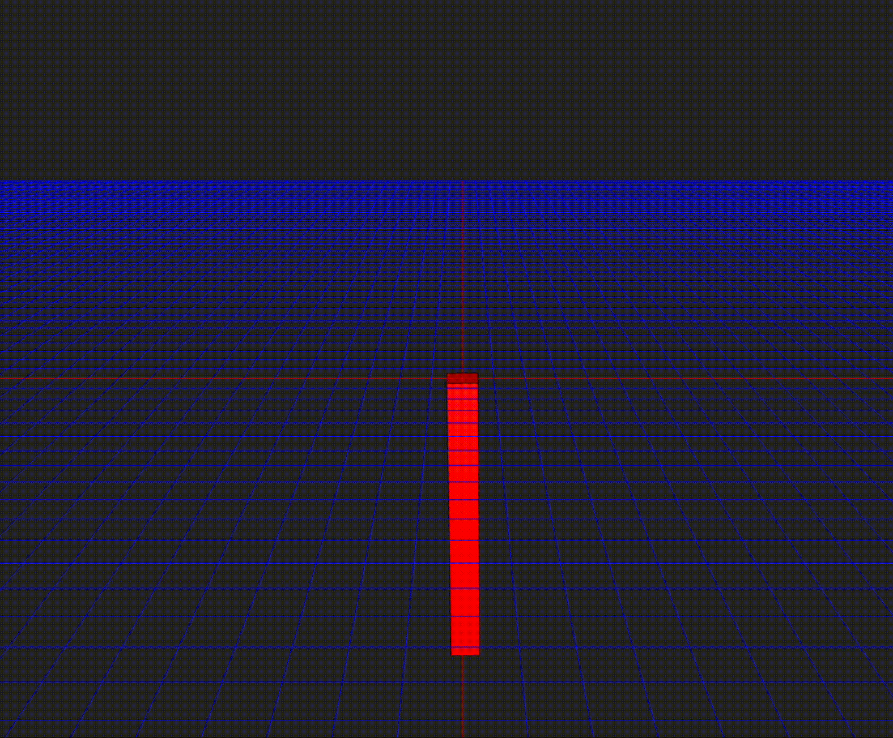

# Orangutan Reinforcement Learning (for robotics in Rust)

This is an experimental project that runs reinforcement learning in your browser.

## References

Physics engine: [gorilla-physics](https://github.com/one-for-all/gorilla-physics)

Deep Learning framework: [burn](https://github.com/tracel-ai/burn)
